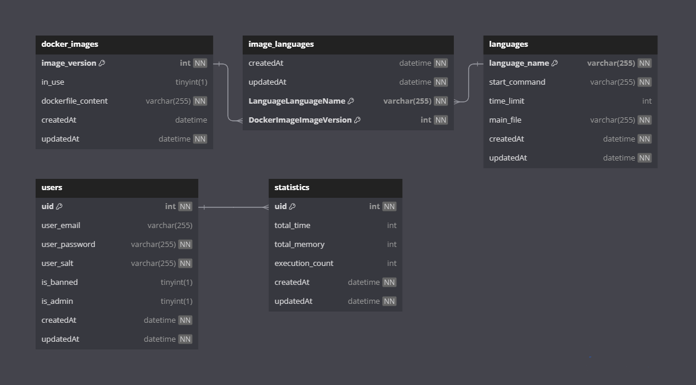
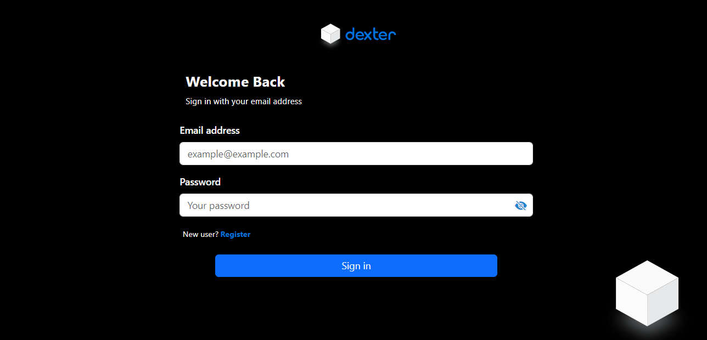
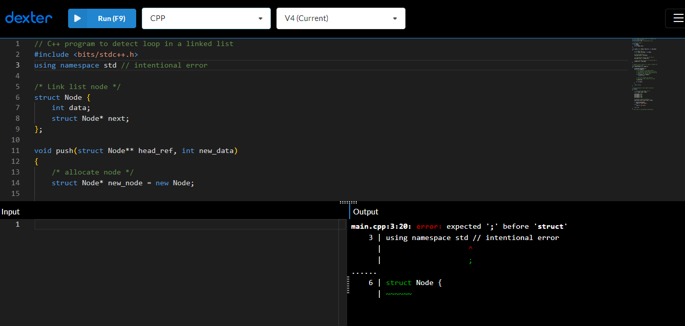
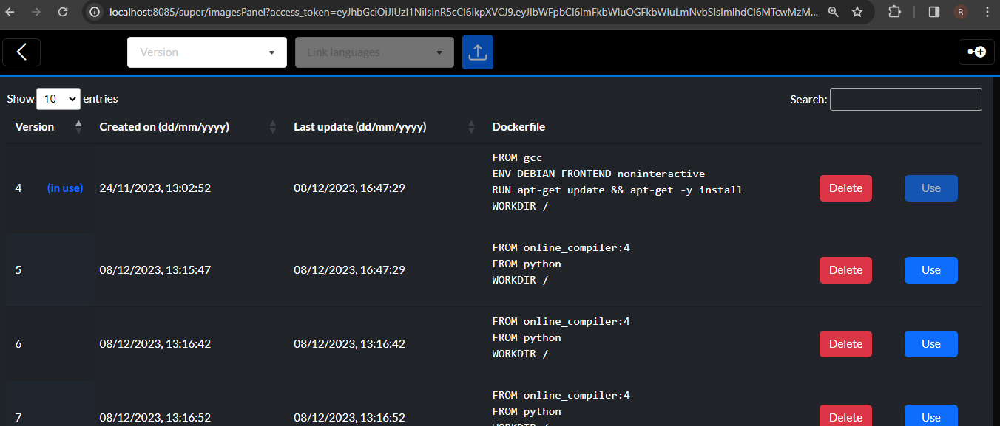
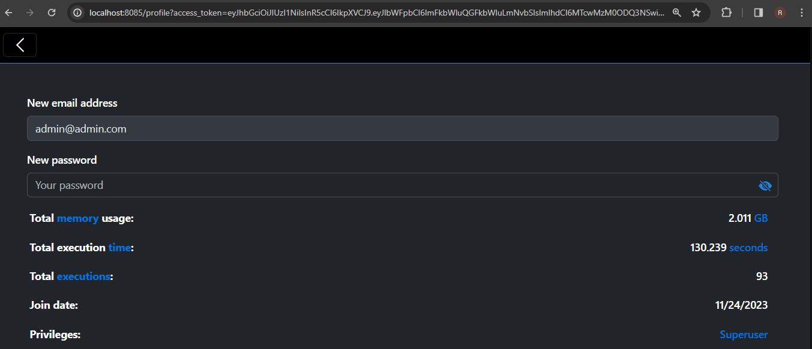

# Dexter

Dexter is an online compiler that leverages Node.js and Docker to execute user-provided programs. It offers dynamic Docker image creation, ability to add and remove programming languages, and maintains a database to log user execution statistics.

## Table of Contents

- [Technologies Used](#technologies-used)
- [Database Schema](#database-schema)
- [Editor Design](#editor-design)
- [API Endpoints](#api-endpoints)
- [Setup](#setup)
- [Usage](#usage)
- [License](#license)

## Technologies Used

- **Node.js**: The server-side runtime environment.
- **Docker**: Containerization technology for executing user-provided programs.
- **Express.js**: Web application framework for Node.js.
- **MySQL**: SQL database for storing user execution statistics.
- **Dockerode**: Node.js Docker API library for managing Docker containers.
- **Sequelize**: ORM for the MySQL database.
- **JWT**: To provide secure transmission of information.
- **BCrypt**: To store user data securely in the database.
- **Typescript**: To provide early error detection, while writing the code.
- **EJS, HTML, CSS, jQuery, & Boostrap**: For the web interface.

## Database Schema

Dexter utilizes MySQL to store user execution statistics. Below is a representation of the database schema:

## Editor Design

Dexter provides a web interface for the users, the admins, and the superuser.
The editor provides syntax highlighting, suggestions, & many more features that are provided by the Monaco editor.
Note that the names of programming languages must adhere to the naming of the languages provided under the languages dropdown menu of the following [demo by Microsoft](https://microsoft.github.io/monaco-editor/).
The interface also provides the admins with the ability to monitor users.
The superuser can control the languages and the Docker images through the website.

- To run the web interface, simply follow the usage instructions and visit the website through `http://localhost:{your port number}`.

- Login page

- Home page

- Docker images table

- User profile page

## API Endpoints

Dexter exposes the following API endpoints for interaction:

- Note that the absence of a response implies the return of a HTTP response code only.

- `/`
  - **Method**: GET
  - **Description**: Used to check connection to server. 

- `/api/users/authenticate`
  - **Method**: POST
  - **Description**: Authenticates the user, returns a token if successful.
  - **Parameters**: 
    - `email`: User email.
    - `password`: User password.
  - **Response**:
    - `token`: JWT token valid for 24h.  

- `/api/users/admin/allUsers`
  - **Method**: POST
  - **Description**: Returns a list of all users in the database.
  - **Parameters**:
    - `Authorization header`: having the a valid admin token.  
  - **Response**:
    - `users`: List of all user emails.  

- `/api/users/userData`
  - **Method**: POST
  - **Description**: Returns user data and statistics.
  - **Parameters**:
    - `Authorization header`: having the a valid user token.  
  - **Response**:
    - `user`: user data.
    - `statistics`: user statistics.  

- `/api/users/register`
  - **Method**: POST
  - **Description**: Creates a new user, returns a token if successful.
  - **Parameters**: 
    - `email`: User email.
    - `password`: User password.
  - **Response**:
    - `token`: JWT token valid for 24h.  

- `/api/users/admin/createUser`
  - **Method**: POST
  - **Description**: Creates a new user. User can be an admin.
  - **Parameters**:
    - `Authorization header`: having the a valid admin token.
    - `email`: user email.
    - `password`: user password.
    - `isAdmin`: true the new user is an admin.
  - **Response**:
    - `token`: JWT token valid for 24h.

- `/api/users/admin/deleteUser`
  - **Method**: DELETE
  - **Description**: Deletes a user, along with its statistics.
  - **Parameters**:
    - `Authorization header`: having the a valid admin token.
    - `email`: email of user to delete.
   
- `/api/users/admin/setUserBanStatus`
  - **Method**: POST
  - **Description**: Bans/unbans a user.
  - **Parameters**:
    - `Authorization header`: having the a valid admin token.
    - `email`: email of user to ban/unban.
    - `isBanned`: true bans user, false unbannes user if banned.
   
- `/api/users/updateUser`
  - **Method**: POST
  - **Description**: Updates the user.
  - **Parameters**:
    - `Authorization header`: having the user token.
    - `newEmail`: new email of the user, optional.
    - `newPassword`: new password of the user, optional.
   
- `/api/statistics/totalStatistics`
  - **Method**: POST
  - **Description**: Returns the total statistics.
  - **Parameters**:
    - `Authorization header`: having a valid admin token.
  - **Response**:
    - `memory`: total memory consumed in bytes.
    - `time`: total time spent in milliseconds.
    - `execCount`: total number of program executions.
   
- `/api/exec/execute`
  - **Method**: POST
  - **Description**: Executes user code.
  - **Parameters**:
    - `Authorization header`: having the user token.
    - `program`: user program to be executed.
    - `input`: input to the program, given at runtime. Optional.
    - `lang`: programming language name to user, chosen from available list.
    - `version`: version of the image to user. Usable only by admins.
  - **Response**:
    - `output`: program output result formatted to HTML form, in order to preserve its design.
   
- `/api/exec/list`
  - **Method**: GET
  - **Description**: Returns list of usable programming language names.
  - **Response**:
    - `langs`: list of programming languages.

- `/api/exec/admin/currentRunning`
  - **Method**: POST
  - **Description**: Returns the number of currently running containers.
  - **Parameters**:
    - `Authorization header`: having a valid admin token.
  - **Response**:
    - `current_running`: number of currently running containers.
   
- `/api/docker/latestImage`
  - **Method**: POST
  - **Description**: Returns latest image (with the highest version number).
  - **Parameters**:
    - `Authorization header`: having a valid admin token.
  - **Response**:
    - `image`: latest Docker image.
   
- `/api/docker/imageHistory`
  - **Method**: POST
  - **Description**: Returns all docker images.
  - **Parameters**:
    - `Authorization header`: having a valid admin token.
  - **Response**:
    - `history`: all Docker images.

- `/api/docker/latestImage`
  - **Method**: POST
  - **Description**: The current running image.
  - **Parameters**:
    - `Authorization header`: having a valid admin token.
  - **Response**:
    - `image`: in use Docker image.

- `/api/docker/super/setCurrentImage`
  - **Method**: POST
  - **Description**: Changes the current Docker image on the server to a pre-built image.
  - **Parameters**:
    - `Authorization header`: having a valid superuser token.
    - `version`: version of the image to use.

- `/api/docker/super/createImage`
  - **Method**: POST
  - **Description**: Creates a new Docker image.
  - **Parameters**:
    - `Authorization header`: having a valid superuser token.
    - `version`: version of the new image.
    - `dockerfile`: contents of the Dockerfile, used to construct the image.
  - **Response**:
    - `image`: newly created Docker image.

- `/api/docker/super/deleteImage`
  - **Method**: DELETE
  - **Description**: Deletes a Docker image, that is NOT in use.
  - **Parameters**:
    - `Authorization header`: having a valid superuser token.
    - `version`: version to be deleted.
  - **Response**:
    - `result`: Data of the deleted Docker image.

- `/api/docker/super/linkLanguages`
  - **Method**: POST
  - **Description**: Links programming languages to a Docker image, making them usable by the image.
  - **Parameters**:
    - `Authorization header`: having a valid superuser token.
    - `version`: version of the image to link.
    - `langs`: list of previously created programming language names to be linked to the image.

- `/api/docker/super/unlinkLanguages`
  - **Method**: POST
  - **Description**: unlinks programming languages to a Docker image, making them unusable by the image.
  - **Parameters**:
    - `Authorization header`: having a valid superuser token.
    - `version`: version of the image to unlink.
    - `langs`: list of previously created programming language names to be unlinked from the image.

- `/api/docker/super/createLanguage`
  - **Method**: POST
  - **Description**: Create a new programming language.
  - **Parameters**:
    - `Authorization header`: having a valid superuser token.
    - `name`: name of the programming language, used to access it by images.
    - `startCommand`: linux shell command used to run a main file of the programming language.
    - `mainFile`: name of the main file with the extension. Used to store user program before running.
    - `timeLimit`: time limit in milliseconds for the language. Optional, uses default time limit if not present. 
  - **Response**:
    - `lang`: newly created programming language.
   
- `/api/docker/super/getLanguage`
  - **Method**: POST
  - **Description**: Returns a programming language.
  - **Parameters**:
    - `Authorization header`: having a valid superuser token.
    - `name`: name of the programming language to get.
  - **Response**:
    - `result`: the requested programming language details.

- `/api/docker/super/deleteLanguage`
  - **Method**: DELETE
  - **Description**: Deletes a programming language, along with any relations.
  - **Parameters**:
    - `Authorization header`: having a valid superuser token.
    - `name`: name of the programming language to delete.
  - **Response**:
    - `result`: the deleted programming language details.

- `/api/docker/super/updateLanguage`
  - **Method**: POST
  - **Description**: Updates a programming language.
  - **Parameters**:
    - `Authorization header`: having a valid superuser token.
    - `name`: name of the programming language to update.
    - `startCommand`: new start command. Optional.
    - `mainFile`: new main file. Optional.
    - `timeLimit`: new time limit. Optional.

## Setup

- On Windows: follow this manual (https://docs.docker.com/desktop/wsl) to get Linux based containers to work on your machine.
- On Linux: make sure to have Docker installed.
   
1. Clone the repository: `git clone https://github.com/YamanSD/dexter.git`
2. Install dependencies: `npm install`
3. Set up the MySQL connection in the [.env](./env_example) configuration file. **ALL** parameters must be filled, according to your environment.
4. Start the application: `npm start`

- By default, each user is given 60 seconds of execution time per run and 100 MiB of execution memory. To change these parameters, refer to [containerConfig.ts](./exec/containerConfig.ts).

## Usage

- To test the API, you must install Postman or any equivalent application of your choice.

- First and formost, you must create a new image, as non-exist.
  - An example [Dockerfile](./Dockerfile) that installs Ubuntu and the GCC compiler is provided.

- Have Docker and MySQL running on your machine, then start the Node.js server using `npm start` in the project directory.

- Next go to Postman and check the connection using `http://YOUR_IP:YOUR_PORT`, that you provided in the [.env](./env_example) file. If you get a response, then MySQL is working properly.

- You must then authenticate using the super user using the `/api/users/authenticate` end point. No need to create the super user, they are automatically created. If successful you will receive a JWT token that you have to copy. Paste the token in the headers of requests as `Authorization`.

- Next we have to create an image using `/api/docker/super/createImage`.
  In the `dockerfile` field, copy paste the example [Dockerfile](./Dockerfile),
  and make sure to replace all new lines with `\n` in the dockerfile string field in the JSON request body. The `version` field can be any positive integer you want. It will take some time to receive a response, as the image content is being downloaded.

- If the server crashes in the previous step, make sure you have setup Docker correctly.

- We then use the image we created using `/api/docker/super/setCurrentImage`. Where the `version` is the integer we provided earlier.

- If all is good, we have to then create a programming language using `/api/docker/super/createLanguage`. For this example, we will create C.
In the `name` field, add any name you want (C, c_gcc, etc...), but make sure it is a clear name, as it cannot be changed later. In the `mainFile` field add `main.c`, as C files end with `.c` extension. The `startCommand` should be `gcc main.c -o app && ./app`, this will compile the main.c file and run it directly.

- Next we have to link the language to the image using `/api/docker/super/linkLanguages`. In the `version` field, add the version you previously used for your image. In the `langs` add `[YOUR_C_NAME]`.

- We can use the superuser to execute code, but for the sake of the demo we can create a user using `/api/users/register`, and we get back a new token.

- Now we have to test if execution works using `/api/exec/execute`.
  We add our new token in the header. In the `program` field we add our C program; we will use the (example.c)[./example.c]. We copy the content, then we have convert it into a JSON valid string. All special characters must have their backslashes doubled, and all double quotes must be backslashed. Any non-double escaped character will be interpreted literally by the server.
  Next, we have to sepcify the language `lang`, which is the name we used for C eariler. And finally we have to provide `input` as the, program requires input ("1 100", for example). We run and we should get the sum of integers from 1 to 100, if using the `example.c`.

## License

This project is licensed under the [MIT License](LICENSE).
